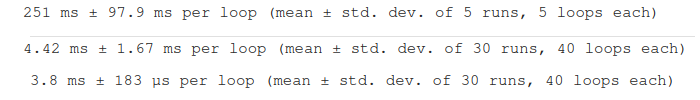

# Dynamic Low Rank Approximations and Bidiagonalization

## Overview

Consider a matrix-valued function 𝐴(𝑡) ∈ ℝ^(𝑚×𝑛), where 𝑛 ≤ 𝑚, for 𝑡 ∈ [0,𝑇]. The objective is to find a low-rank approximation of 𝐴(𝑡) for all 𝑡.
One approach is to use a matrix 𝑋(𝑡) ∈ ℝ^(𝑚×𝑛) with rank 𝑘 < 𝑛, minimizing ∥𝑋(𝑡) − 𝐴(𝑡)∥𝐹.

The low-rank approximation 𝑋(𝑡) can be computed by considering the truncated singular value decomposition (SVD),
including terms corresponding to the 𝑘 largest singular values of 𝐴(𝑡), for all values of 𝑡 of interest.

To enhance cost-effectiveness, we implement a Dynamic Low Rank (DLR) approximation method and compare its performance to the Lanczos bidiagonalization method and NumPy's implementation of SVD.

We further evaluate the DLR method on different Ordinary Differential Equations (ODEs) to determine its efficiency in computing solutions.

## Results

The main results can be found in the file main.py. Here we only show an improvement we implemented to make the DLR method faster.

  
  
  

